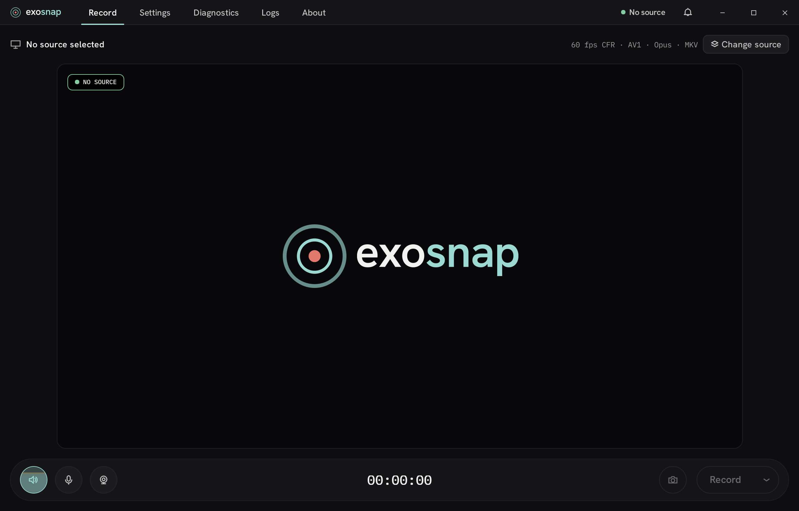

<div align="center">

# ExoSnap

[](https://github.com/Exoridus/exosnap/releases/latest)
[](https://github.com/Exoridus/exosnap/releases/latest)
[](https://github.com/Exoridus/exosnap/actions/workflows/ci.yml)
[](https://github.com/Exoridus/exosnap/blob/main/LICENSE)

A diagnostics-first, Windows-native screen/application/region recorder. MKV-first capture with
on-stop MP4 remux, a native NVENC pipeline, multi-track audio routing, HDR10 monitor capture,
and a pre-flight readiness gate that blocks recording before a misconfiguration ruins it —
no account, no analytics telemetry, and recordings are never uploaded or processed in the cloud
(update checks against public GitHub Releases and consent-gated crash reports are the only
opt-in network features; see [`PRIVACY.md`](PRIVACY.md)).

**[Releases](https://github.com/Exoridus/exosnap/releases)** · **[Roadmap](docs/roadmap.md)** · **[Known limitations](KNOWN_LIMITATIONS.md)** · **[Privacy](PRIVACY.md)**

</div>



> **Pre-1.0.** ExoSnap is a Windows preview, not a finished 1.0. Settings, preset, and
> recording-history file formats may change incompatibly between releases.
>
> **NVIDIA NVENC is required.** ExoSnap only supports NVIDIA hardware encoding today
> (RTX 20-series or newer recommended). AMD, Intel, and software encoding are not available yet —
> see the [roadmap](docs/roadmap.md) for the vendor-expansion plan.
>
> **Windows 10/11 x64 only.** Windows 11 is the primary target; Windows 10 is best-effort.
> Distributed as a portable ZIP and an MSI installer, neither is code-signed yet, so Windows
> SmartScreen may warn on first launch (see [Code signing](#code-signing)).

## Features

### Reliability & recovery

- **Crash recovery** — a recovery manifest is written before each session; a startup overlay offers
  the finish/continue/discard actions still available for each interrupted recording on the next
  launch. Already-finalized split segments are always recoverable; the active segment interrupted
  by the crash itself may not be — see [`KNOWN_LIMITATIONS.md`](KNOWN_LIMITATIONS.md).
- **MKV-first recording** with on-stop MP4 remux (progressive, faststart) via libavformat
  stream-copy; MKV and WebM are also available as direct output formats.
- **Low-disk guard** — warns at a configurable soft threshold and hard-stops at a lower one,
  accounting for the transient MKV + output MP4 coexisting during remux.
- **FAT32 awareness** — flags the 4 GiB per-file limit as a Diagnostics notice without blocking
  short recordings.
- **Container/codec compatibility registry** — invalid combinations are rejected before recording
  starts, never mid-session.
- Recording split (by time and/or size, first limit reached wins) with
  per-segment background MP4 remux.

### Diagnostics as a feature

- **Pre-flight readiness gate** — blockers and notices surface before you hit record, so a
  misconfigured capture is caught up front instead of failing mid-recording.
- **Typed `FixAction` model** (Auto / Assisted / External) — every detected issue carries its
  safest concrete remedy, not just a warning string.
- **Live pipeline monitoring** — frame drops, A/V drift, disk-fill ETA, and an on-screen size/drift
  overlay, with encoder-vs-capture-vs-disk-bound classification and root-cause correlation (e.g.
  VRR-vs-CFR judder).
- **Post-flight report card** — frame-drop percentage, peak A/V drift, and pipeline health after
  every recording.
- **Opt-in `PresentMon` provider** — elevation-gated tearing/game-present observation feeding the
  judder correlation, never a hard dependency.
- **Recording-error dialog** — if a recording fails, a modal report explains why, with an opt-in,
  privacy-scrubbed GitHub issue you can choose to file.

### Video & HDR

- Native NVENC pipeline: **H.264, HEVC, and AV1**, with 10-bit (P010) output for HEVC Main10 and
  AV1.
- **Canonical rate-control model** — Constant quality, Variable bitrate, Constant bitrate, mapped
  per encoder underneath; never mislabeled as x264/x265-style "CRF".
- BT.709 color metadata on every output, plus a selectable Y'CbCr color range (Full/Limited) with
  a Diagnostics compatibility notice for players that ignore the range flag.
- **HDR displays are detected automatically.** By default an HDR desktop records as tone-mapped
  SDR (BT.709) for universal playability. An expert "HDR handling" setting switches to **native
  HDR10 recording** — PQ/BT.2020, P010 10-bit, limited range, with mastering-display metadata
  carried into remuxed MP4. Native HDR10 requires HEVC or AV1 and covers **both monitor and
  window/game capture** (the latter via a scRGB FP16 frame pool); see
  [`KNOWN_LIMITATIONS.md`](KNOWN_LIMITATIONS.md) for the exact boundary.
- Webcam PiP overlay with live mirrored preview, DXGI-composited.

### Audio

- Multi-track routing with the default source order **`APP`, `SYS`, `MIC`**, each recorded to its
  own default track; any source can merge onto the track above it.
- Per-track gain, mute, and a brickwall limiter (on by default) on the mixed bus.
- Microphone DSP chain — high-pass filter, noise gate, AGC, and RNNoise neural noise suppression —
  each stage off by default and individually toggled.
- Lossless **PCM** and **FLAC** (MKV-only) alongside Opus and AAC; configurable sample rate,
  channel count, and bit depth.

### Presence & workflow

- Capture-excluded on-screen overlays (recording status, diagnostics, countdown) via
  `WDA_EXCLUDEFROMCAPTURE` — visible to you, invisible to the recording.
- Tray icon with idle/recording/paused states, an unread notification badge, and a notification
  hub alongside toast notifications.
- Global hotkeys, single-frame capture, and an opt-in interactive quick-control pill overlay.
- **TOML recording presets** with human-readable export/import and a manage dialog (rename,
  duplicate, delete, set default).
- Four curated themes (two dark, two light) with instant single-click preview and selection; dark
  mode is the default.
- Local-first crash capture (out-of-process Crashpad) with a consent-gated, privacy-scrubbed
  next-launch crash dialog.
- In-app updates (Stable/Preview channels): a signature- and hash-verified download and in-place
  install via a dedicated updater process, with rollback on failure. Always off by default for
  self-built binaries, and every install step is visible to the user — never a silent auto-install.

See [`KNOWN_LIMITATIONS.md`](KNOWN_LIMITATIONS.md) for the precise current support boundary and
[`docs/roadmap.md`](docs/roadmap.md) for where this is headed.

## Product defaults

| Setting | Default |
|---------|---------|
| Theme | Dark mode |
| Container | MKV |
| Video codec | AV1 (NVENC) |
| Audio codec | Opus |
| Frame rate | CFR 60 fps |
| Audio source order | `APP`, `SYS`, `MIC` — context-aware defaults (`APP` only exists for a captured application window, enabled there; screen capture defaults `SYS` on, `MIC` off), each enabled source its own track |
| Navigation pages | `Record`, `Device`, `Settings`, `Diagnostics`, `Logs`, `About` |

## Install / run

See [`README-PORTABLE.md`](README-PORTABLE.md) for the portable-release quick start.

**Runtime prerequisite:** the **Microsoft Visual C++ 2022 x64 Redistributable** is required. It is
normally already present on up-to-date Windows systems. If the app fails to start with a
missing-DLL error, install it from <https://aka.ms/vs/17/release/vc_redist.x64.exe>.

The portable build is not code-signed. Windows SmartScreen may warn on first launch — this is
expected (see [Code signing](#code-signing)).

## Building from source

**Prerequisites:** Visual Studio 2022 (Desktop development with C++ workload), CMake 3.27+, Git.

Fast local development loop:

```powershell
cmake --preset windows-x64-debug
cmake --build --preset windows-x64-debug-exosnap
scripts\run-tests.ps1 -Filter <binary_name>.
scripts\check-format.ps1
```

Full gate before merge:

```powershell
scripts\check-format.ps1
git diff --check
cmake --build --preset windows-x64-debug
scripts\run-tests.ps1
scripts\check-quality.ps1 -StaticOnly
cmake --build --preset windows-x64-release-exosnap
```

`scripts\run-tests.ps1` sets up the environment every test binary needs (throwaway
`EXOSNAP_CONFIG_DIR`, offscreen Qt platform, Qt on `PATH`) and prints a compact summary plus any
failing gtest cases; each CTest entry is one test **binary**, and `-Filter`/`-R` match binary
names (e.g. `recorder_core.`), not individual gtest cases. Optional faster/cached builds are
available via Ninja and sccache (`winget install Ninja-build.Ninja` / `Mozilla.sccache`). C++ code
is formatted with `clang-format` and checked with `clang-tidy`; run `scripts\pre-commit.ps1` before
committing. See [`AGENTS.md`](AGENTS.md) for the full build-tooling reference.

## Repo layout

```text
app/          application source (UI, models, recording pipeline)
libs/         internal libraries (recorder_core, capability, etc.)
docs/
  roadmap.md  version roadmap and architecture guardrails
  decisions/  architecture decision records (ADRs)
packaging/    WinGet, Chocolatey, and Scoop packaging manifests
scripts/      build, quality, and release scripts
tests/        test targets
cmake/        CMake helper modules (VendorFFmpeg, etc.)
third_party/  vendored third-party sources (libmatroska, libebml, etc.)
tools/        developer tooling
```

## Third-party / licensing

- ExoSnap is licensed under **GPL-3.0-or-later**; see [`LICENSE`](LICENSE).
- ExoSnap bundles FFmpeg as **LGPL-2.1-or-later** shared DLLs (dynamic linking). Third-party
  component licenses are listed in [`THIRD_PARTY_NOTICES.md`](THIRD_PARTY_NOTICES.md).
- The FFmpeg binaries are produced by the companion repository
  [Exoridus/exosnap-ffmpeg-build](https://github.com/Exoridus/exosnap-ffmpeg-build).

## Code signing

ExoSnap participates in the [SignPath Foundation](https://signpath.org) free code-signing program
for open-source projects, with code-signing infrastructure provided by
[SignPath.io](https://signpath.io). Once the certificate is issued, Windows release binaries
(portable ZIP and MSI) will be signed; pre-certificate builds are unsigned, so Windows SmartScreen
may warn on first launch.

## Contributing / CI

GitHub Actions runs configure, build, and test on Windows for both `windows-x64-debug` and
`windows-x64-release`, plus a lint pass. PRs are the review gate.

## Links

- Repository: <https://github.com/Exoridus/exosnap>
- Issues: <https://github.com/Exoridus/exosnap/issues>
- Privacy: [`PRIVACY.md`](PRIVACY.md)
- Security: [`SECURITY.md`](SECURITY.md)
